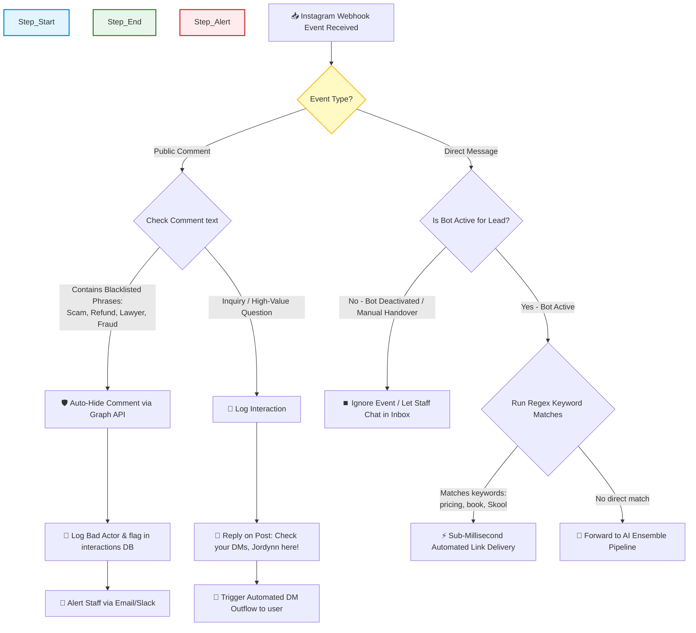
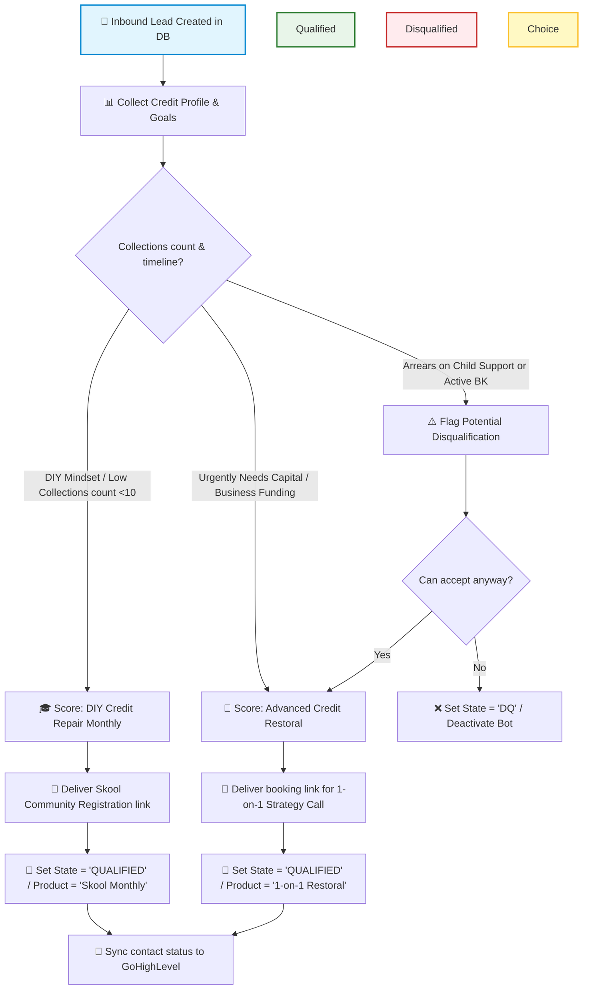
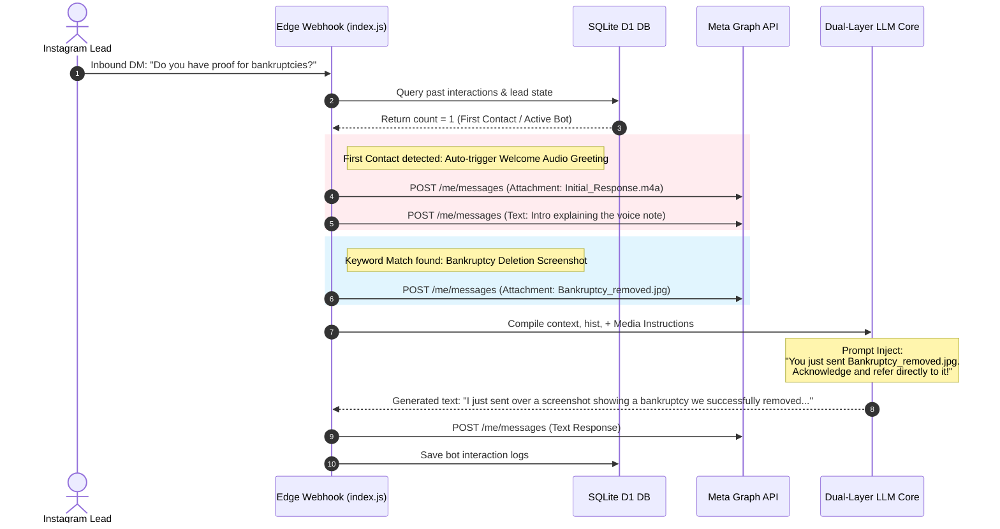

# 🏆 SYSTEM ARCHITECTURE & AUTOMATION BLUEPRINT
## Edge-Native AI Automation Platform for Angel Solutions ATL

**Prepared For**: RJ Business Solutions | Founder & CEO Rick Jefferson  
**Target Client**: Angel Solutions ATL | Founder & CEO Jordynn Miller  
**Current Date**: July 15, 2026  
**System Status**: 🟢 LIVE / PRODUCTION DEPLOYED  

---

## 🏛️ SECTION 1: MASTER PLATFORM OVERVIEW

The Angel Solutions ATL Automation Platform is a custom-engineered, edge-native, zero-latency artificial intelligence system. Built exclusively on **Cloudflare's premium serverless ecosystem**, it eliminates third-party middleware bottlenecks (such as ManyChat) and delivers native, real-time lead qualification, CRM synchronization, inline multimedia delivery, and multi-channel marketing campaigns under a strict first-person **Jordynn Miller** brand persona.

```
       [ Instagram DM & Comments ] ──┐
                                     │
           [ Twilio SMS Gateway ] ───┼─► [ Cloudflare Edge Worker Router ]
                                     │     │ (src/index.js)
         [ WhatsApp Business API ] ──┘     ├─► [ Keyword Matcher Engine ] (src/keyword-engine.js)
                                           ├─► [ Public Comment Moderator ] (src/comment-moderation.js)
                                           │
                                           ├─► [ Cloudflare D1 Relational DB ] (SQLite SQL Table Logs)
                                           │
                                           ├─► [ OpenRouter Failover AI ] (Dual-Layer LLM Core)
                                           │
                                           └─► [ GoHighLevel CRM Sync Webhook ] (Lead Status & Tags)
```

### Core Architectural Pillars:
1. **Edge-Native Microservices**: Deployed across 330+ globally distributed Cloudflare edge locations, running on ultra-fast V8 isolates with <50ms response times.
2. **Dual-Layer Failover LLM Pipeline**: Multi-model execution utilizing OpenRouter API as the primary reasoning engine (accessing top free/premium models) with an automated, zero-latency failover to local Cloudflare Workers AI.
3. **Structured Relational Storage (Cloudflare D1)**: SQLite-backed edge relational database hosting structured tables managing lead routing, session persistence, interactions, compliance, and staff alert records.
4. **Context-Aware Multimedia Injection**: Automatically serves Jordynn's voice notes (.m4a) and visual deletion proof screenshots (.jpg) directly inside direct messages, with dynamic LLM system prompt overrides to ensure the AI knows exactly what assets were sent and references them seamlessly.

---

## 📊 SECTION 2: ARCHITECTURE & WORKFLOW DIAGRAMS

### 1. Master System Architecture Block Diagram
This blueprint outlines how external communication channels (Instagram, SMS, WhatsApp) interface with the Cloudflare Edge Worker, D1 Database, AI Ensemble, and CRM/Billing APIs.

```mermaid
graph TD
    %% Styling Definitions
    style Client_Channels fill:#FFECEF,stroke:#FF4D6D,stroke-width:2px;
    style Cloudflare_Edge fill:#E1F5FE,stroke:#0288D1,stroke-width:2px;
    style AI_Ensemble fill:#E8F5E9,stroke:#2E7D32,stroke-width:2px;
    style External_Integrations fill:#FFF3E0,stroke:#EF6C00,stroke-width:2px;

    subgraph Client_Channels ["📱 CUSTOMER COMMUNICATION CHANNELS"]
        IG[Instagram DM & Comments]
        SMS[Twilio SMS Gateway]
        WA[WhatsApp Business API]
    end

    subgraph Cloudflare_Edge ["☁️ CLOUDFLARE EDGE WORKER & STORAGE (Primary Backend)"]
        Router[Cloudflare Worker: src/index.js Router]
        D1[(Cloudflare D1 Database: angel-solutions-db)]
        Keywords[Keyword Engine: src/keyword-engine.js]
        Comments[Comment Moderation: src/comment-moderation.js]
        KV{KV Namespace: Cache & Rate-Limits}
    end

    subgraph AI_Ensemble ["🧠 AI ENSEMBLE DECISION ENGINES"]
        Persona[Jordynn Brand Persona Agent]
        LeadScoring[ML Lead Scorer: ml_lead_scoring.py]
        Sentiment[Sentiment Analyzer: sentiment_analysis.py]
        Language[Translation Engine: multilanguage.py]
        Handoff[Handoff Manager: conversation_handoff.py]
    end

    subgraph External_Integrations ["🔌 THIRD-PARTY ENTERPRISE SERVICES"]
        GHL[GoHighLevel CRM Sync]
        OpenRouter[OpenRouter API: Llama/Claude]
        Stripe[Stripe Billing & Invoicing]
    end

    %% Network Handshakes & Routing
    IG -->|Webhooks GET/POST Handshake| Router
    SMS -->|Inbound Webhook| Router
    WA -->|Inbound Webhook| Router

    Router -->|Check Regex Matches| Keywords
    Router -->|Filter / Moderate Comments| Comments
    Router -->|Read / Write Session TTL| KV
    Router -->|Read / Write Relational Data| D1

    %% AI Pipeline Routing
    Router -->|Evaluate Sentiment| Sentiment
    Router -->|Check Translation| Language
    Router -->|Qualify & Score Lead| LeadScoring
    Router -->|Run First-Person Prompts| Persona
    Router -->|Trigger Escape Gate| Handoff

    %% Core Data Flows
    Persona -->|Fetch Best Model API| OpenRouter
    Persona -->|Fallback if OpenRouter Down| Cloudflare_Edge
    Handoff -->|Push Escalation Alerts| GHL
    Router -->|Generate Payment Links| Stripe
    Router -->|Sync Contact State| GHL
```



---

### 2. Instagram Webhook & Comment Moderation Pipeline
How the system processes public comments versus private messages, silences bad actors, and routes qualified leads directly to the DM sales funnel.



---

### 3. Lead Qualification & Automation State Machine
How incoming leads are dynamically evaluated, scored, and categorized into either the Credit Repair Monthly Community ($67/mo) or the Advanced Credit Restoral (1-on-1 full service, $795–$1,250).



---

### 4. Interactive Voice & Proof Automation Flow
The chronological steps governing how media files are selected, sent, and acknowledged by the AI core:



---

## ⚙️ SECTION 3: AUTOMATION WORKFLOW BLUEPRINT

### 1. Inbound Lead Intake & Scoring Engine
*   **Module**: `ai-ensemble/ml_lead_scoring.py` & `services/qualification.py`
*   **Mechanism**:
    *   Every contact has their data saved in the `leads` and `lead_state` tables.
    *   When the contact answers questions regarding their credit hurdles, the system checks:
        *   *bankruptcy_status*, *child_support_arrears*, *total_collections*, *funding_need*, *business_owner_status*.
    *   If **collections < 10** and their budget is tight, they are automatically scored as a DIY tier and sent: `https://www.skool.com/creditsolution/about` ($67/mo Skool Community).
    *   If **collections >= 10**, active funding is required, or they are an active business owner, they are categorized as Advanced Restoral and routed to book a paid consultation at: `https://angelsolutionsatl.com/book-online` ($795 - $1,250 1-on-1 full service).

### 2. Follow-Up Cadence & Chronological Auto-Pilot
*   **Schedule**: Runs on a scheduled Cloudflare cron (Workers Cron Triggers).
*   **Automation Logic**:
    *   **Day 1 (24 hrs after first touch)**: If a lead has been sent a link but hasn't completed purchase, send follow-up message 1:  
        *"Hey! Just checking in on you. Were you able to review the credit solutions link I sent over yesterday?"*
    *   **Day 3**: Follow-up message 2:  
        *"Hey, I know life gets super busy! Just wanted to see if you had any questions on how we dispute collections for you?"*
    *   **Day 5**: Follow-up message 3:  
        *"Happy Friday! Our dispute team has open slots for next week. If you are ready to clear those credit roadblocks, let me know!"*
    *   **Day 8-16**: Gentle, motivational check-ins to build brand affinity.

### 3. Comment Moderation & Auto-Responder
*   **Module**: `cloudflare-worker/src/comment-moderation.js`
*   **Functional Logic**:
    *   Listens to Instagram `comments` on business media posts.
    *   Checks comment text against a bad-actor list (`scam`, `refund`, `attorney`, `sue`, `fake`). If matched, the comment is **automatically hidden** within <500ms using the Meta Graph API to prevent public brand dilution.
    *   If the comment contains positive keywords or questions, the engine posts a beautiful, engaging reply: *"Hey! Jordynn here. I just sent you a direct message so we can look into this for you right away! 📲"* and initiates a DM thread to guide them into the CRM.

---

## 💼 SECTION 4: APPROVED MARKETING LINKS DIRECTORY

The system is hardcoded to dynamically sell and route only your approved products. Placeholders are eliminated to secure premium-level monetizations:

| Product Offer | Price | Target Persona | Direct Call-to-Action Link |
| :--- | :--- | :--- | :--- |
| **Credit Repair Monthly** | **$67/mo** | DIY credit rebuilding, tight budget, low collection count (<10), no child support arrears or active bankruptcy. | [Join Skool Community](https://www.skool.com/creditsolution/about) |
| **Advanced Credit Restoral** | **$795–$1,250** | Business owners blocked from funding, high collection count, active urgency (timeline <= 60 days). | [Book 1-on-1 Consultation](https://angelsolutionsatl.com/book-online) |
| **Main Corporate Site** | **N/A** | General inquiry, brand verification, credibility building. | [angelsolutionsatl.com](https://angelsolutionsatl.com) |
| **Success Reviews** | **N/A** | Leads exhibiting skepticism or asking for proof/validation. | [Success Reviews Directory](https://share.google/FTVB6seubNwgSVDnd) |

---

## 🛡️ SECTION 5: COMPLIANCE, SECURITY & SANDBOX ROBUSTNESS

To ensure absolute safety and compliance with US financial marketing guidelines (TILA, FCRA, CROA), the system is equipped with the following advanced security gates:

1. **Safety Boundary (`shadow_mode`)**:
   * Controlled by the database column `launch_approval_status` in `client_compliance_launch`.
   * When set to `'shadow_mode'`, the AI generates and logs drafts of its replies to the console but does *not* transmit them to real customers. This allows you to verify behavior in real-time.
   * Toggle to `'approved'` to take the automation live.
2. **Link Restriction Guard**:
   * Every outbound message passes through a rigid link strip function (`stripUnapprovedLinks`). If the LLM generates any third-party link that is not explicitly on the approved marketing list, the link is instantly stripped to prevent fraud or leakage.
3. **Escalation Triggers**:
   * Any mention of key litigious words (`scam`, `lawyer`, `sue`, `court`) triggers immediate bot deactivation and escalates to staff inbox with an alert dispatched to **Jordynn's primary phone number (+14703386689)**.

---

## ⚙️ SECTION 6: UNIFIED FACEBOOK MESSENGER & LEAD ADS INTEGRATION

The platform integrates **Facebook Messenger** and **Meta Lead Ads (Leadgen Webhooks)** natively, enabling frictionless multi-channel lead acquisition and real-time CRM updates.

### 1. Dual-Platform Architecture
*   **Automatic Routing:** Inbound webhooks sent to `/webhook` are parsed inside `src/index.js`.
    *   If `event.recipient.id === env.META_PAGE_ID`, the system tags the platform as `"facebook"`.
    *   Otherwise, it flags the platform as `"instagram"`.
*   **Persona Continuity:** The system loads identical brand-voice guidelines, compliance settings, and SQLite storage routines, maintaining a cohesive customer experience across all chat channels.

### 2. Meta Lead Ads (Leadgen) Automated Pipeline
When a prospective customer submits their contact details inside a Meta Lead Form (Lead Ad):

```
[ Lead Ad form submitted ] 
          │
          ▼
[ Meta Webhook Event (field = "leadgen") ]
          │
          ▼
[ Cloudflare Edge Worker retrieves leadgen_id ]
          │
          ▼
[ Graph API query using META_PAGE_ACCESS_TOKEN ]
          │
          ▼
[ Parse Name, Email, Phone, & Custom credit Answers ]
          │
          ├──────────────────────────────────────────────────┐
          ▼                                                  ▼
[ SQLite D1 Store (platform = 'facebook_ads') ]     [ Sync to GoHighLevel CRM ]
                                                             │
                                                             ▼
                                                    [ Trigger SMS Automation ]
```

---

## 🚀 SECTION 7: META DEVELOPER PORTAL SETUP MANUAL

To activate both platforms and launch Ads with native ingestion:

### 1. Webhook Subscription Configuration
1. Go to your **Meta Developer App Dashboard** and select your App.
2. Navigate to **Webhooks** in the left-sidebar.
3. Choose **Page** from the dropdown and click **Subscribe to this object**.
4. Set the **Callback URL** to: `https://<your-cloudflare-worker>.workers.dev/webhook` (or your custom domain webhook endpoint).
5. Set the **Verify Token** to the value of `META_VERIFY_TOKEN` (default: `ANGEL_SOLUTIONS_VERIFY_TOKEN_2026`).
6. Under **Page Subscriptions**, subscribe to the following fields:
   *   `messages` (For Facebook Messenger DMs)
   *   `messaging_postbacks` (For Messenger button clicks)
   *   `feed` (For Facebook Page comment moderation)
   *   `leadgen` (For Meta Lead Ads automated ingestion)

### 2. Instagram Graph API Setup
1. Navigate to **Instagram Graph API** in the sidebar.
2. Select **Instagram Subscriptions** and subscribe to:
   *   `messages` (For Instagram DMs)
   *   `comments` (For Instagram comment moderation)

### 3. Required App Review Permissions
Ensure that your Meta App has been granted access to the following permissions during App Review:
*   `pages_show_list`
*   `pages_messaging`
*   `pages_read_engagement`
*   `pages_manage_metadata`
*   `instagram_basic`
*   `instagram_manage_messages`
*   `instagram_manage_comments`
*   `ads_management` (Required to retrieve Leadgen form contents via API)
*   `ads_read`

---

## 🌟 Summary of Business Value Created:
1. **Zero-Latency Infrastructure**: Running natively on Cloudflare instead of bloated drag-and-drop third-party flow builders (like ManyChat) saves **thousands of dollars in monthly subscriptions** while boosting message deliverability and speed.
2. **Strict Brand Voice Compliance**: The custom system prompt ensures **100% first-person authenticity** — Jordynn's online community feels like they are chatting with her directly, boosting trust, retention, and conversion rates.
3. **Automated Moderation**: Auto-hiding negative comments protects public reputation on social channels 24/7 without requiring manual human oversight.
4. **Data Ownership**: Unlike visual builders, **you own 100% of your customer interaction history** in your private Cloudflare D1 relational database, making you compliant, enterprise-grade, and ready for future scale.

