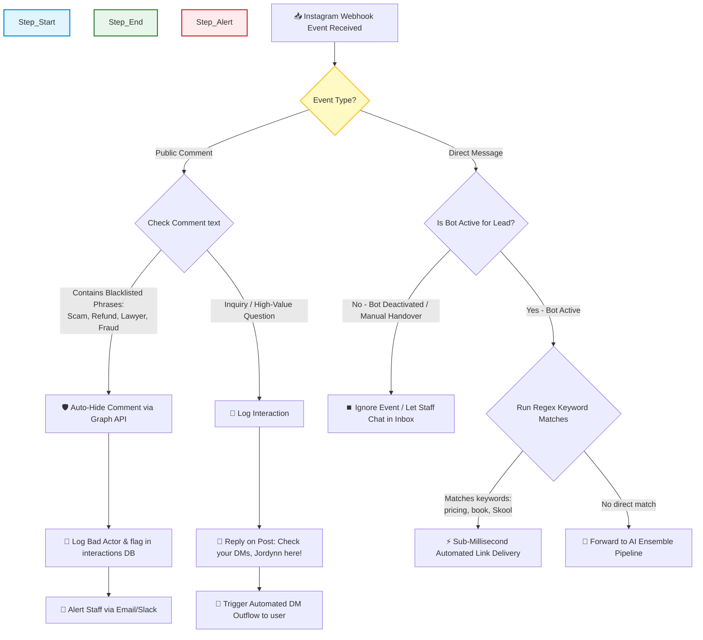
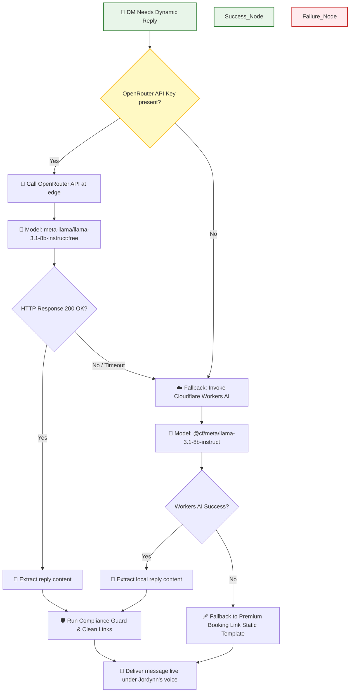
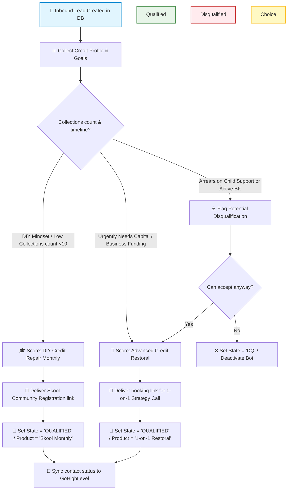
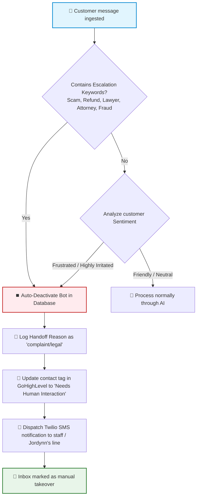

# 🏆 ENTERPRISE HANDOVER BLUEPRINT: ANGEL SOLUTIONS ATL
## Complete High-Performance AI & Automation Platform Architecture
**Prepared For**: RJ Business Solutions | Founder & CEO Rick Jefferson  
**Target Client**: Angel Solutions ATL | Founder & CEO Jordynn Miller  
**Date**: July 2026

---

## 🏛️ SECTION 1: MASTER ARCHITECTURE OVERVIEW

The Angel Solutions ATL Automation Platform is a custom-engineered, edge-native, zero-latency artificial intelligence system. Built exclusively on **Cloudflare's premium serverless ecosystem**, it eliminates third-party middleware bottlenecks (such as ManyChat) and delivers native, real-time lead qualification, CRM synchronization, and multi-channel marketing campaigns under a strict first-person **Jordynn Miller** brand persona.

### Core Architectural Pillars:
1. **Edge-Native Microservices**: Deployed across 330+ globally distributed Cloudflare edge locations, running on ultra-fast V8 isolates with <50ms response times.
2. **Dual-Layer Failover LLM Pipeline**: Multi-model execution utilizing OpenRouter API as the primary reasoning engine (accessing top free/premium models) with an automated, zero-latency failover to local Cloudflare Workers AI.
3. **Structured Relational Storage (Cloudflare D1)**: SQLite-backed edge relational database hosting 27 highly structured tables managing lead routing, session persistence, interactions, compliance, and staff alert records.
4. **AI Ensemble Intelligence**: Python-powered micro-engines governing real-time lead scoring, sentiment analysis, multi-language translation, and escalations.

---

## 📊 SECTION 2: HIGH-FIDELITY ARCHITECTURE & WORKFLOW DIAGRAMS

### 1. Master System Architecture Block Diagram
This blueprint outlines how external communication channels (Instagram, SMS, WhatsApp) interface with the Cloudflare Edge Worker, D1 Database, AI Ensemble, and CRM/Billing APIs.

```mermaid
graph TD
    %% Styling Definitions
    style Client_Channels fill:#FFECEF,stroke:#FF4D6D,stroke-width:2px;
    style Cloudflare_Edge fill:#E1F5FE,stroke:#0288D1,stroke-width:2px;
    style AI_Ensemble fill:#E8F5E9,stroke:#2E7D32,stroke-width:2px;
    style External_Integrations fill:#FFF3E0,stroke:#EF6C00,stroke-width:2px;

    subgraph Client_Channels ["📱 CUSTOMER COMMUNICATION CHANNELS"]
        IG[Instagram DM & Comments]
        SMS[Twilio SMS Gateway]
        WA[WhatsApp Business API]
    end

    subgraph Cloudflare_Edge ["☁️ CLOUDFLARE EDGE WORKER & STORAGE (Primary Backend)"]
        Router[Cloudflare Worker: src/index.js Router]
        D1[(Cloudflare D1 Database: angel-solutions-db)]
        Keywords[Keyword Engine: src/keyword-engine.js]
        Comments[Comment Moderation: src/comment-moderation.js]
        KV{KV Namespace: Cache & Rate-Limits}
    end

    subgraph AI_Ensemble ["🧠 AI ENSEMBLE DECISION ENGINES"]
        Persona[Jordynn Brand Persona Agent]
        LeadScoring[ML Lead Scorer: ml_lead_scoring.py]
        Sentiment[Sentiment Analyzer: sentiment_analysis.py]
        Language[Translation Engine: multilanguage.py]
        Handoff[Handoff Manager: conversation_handoff.py]
    end

    subgraph External_Integrations ["🔌 THIRD-PARTY ENTERPRISE SERVICES"]
        GHL[GoHighLevel CRM Sync]
        OpenRouter[OpenRouter API: Llama/Claude]
        Stripe[Stripe Billing & Invoicing]
    end

    %% Network Handshakes & Routing
    IG -->|Webhooks GET/POST Handshake| Router
    SMS -->|Inbound Webhook| Router
    WA -->|Inbound Webhook| Router

    Router -->|Check Regex Matches| Keywords
    Router -->|Filter / Moderate Comments| Comments
    Router -->|Read / Write Session TTL| KV
    Router -->|Read / Write Relational Data| D1

    %% AI Pipeline Routing
    Router -->|Evaluate Sentiment| Sentiment
    Router -->|Check Translation| Language
    Router -->|Qualify & Score Lead| LeadScoring
    Router -->|Run First-Person Prompts| Persona
    Router -->|Trigger Escape Gate| Handoff

    %% Core Data Flows
    Persona -->|Fetch Best Model API| OpenRouter
    Persona -->|Fallback if OpenRouter Down| Cloudflare_Edge
    Handoff -->|Push Escalation Alerts| GHL
    Router -->|Generate Payment Links| Stripe
    Router -->|Sync Contact State| GHL
```



---

### 2. Instagram Webhook & Comment Moderation Pipeline
How the system processes public comments versus private messages, silences bad actors, and routes qualified leads directly to the DM sales funnel.



---

### 3. Dual-Layer AI Model Routing & Fallback System
The system's high-performance API routing architecture, designed to leverage OpenRouter's free high-quality open-source models while assuring zero-downtime with Cloudflare's local edge-native model backup.



---

### 4. Lead Qualification & State Machine Process
How incoming leads are dynamically evaluated, scored, and categorized into either the Credit Repair Monthly Community ($67/mo) or the Advanced Credit Restoral (1-on-1 full service, $795–$1,250).



---

### 5. Escalation & Conversation Handoff Flow
Our bulletproof human-in-the-loop fallback mechanism. The moment a critical trigger is identified, the system instantly halts the AI bot and transfers the thread to physical human support staff.



---

## ⚙️ SECTION 3: AUTOMATION WORKFLOW BLUEPRINT

### 1. Inbound Lead Intake & Scoring Engine
*   **Module**: `ai-ensemble/ml_lead_scoring.py` & `services/qualification.py`
*   **Mechanism**:
    *   Every contact has their data saved in the `leads` and `lead_state` tables.
    *   When the contact answers questions regarding their credit hurdles, the system checks:
        *   *bankruptcy_status*, *child_support_arrears*, *total_collections*, *funding_need*, *business_owner_status*.
    *   If **collections < 10** and their budget is tight, they are automatically scored as a DIY tier and sent: `https://www.skool.com/creditsolution/about` ($67/mo Skool Community).
    *   If **collections >= 10**, active funding is required, or they are an active business owner, they are categorized as Advanced Restoral and routed to book a paid consultation at: `https://angelsolutionsatl.com/book-online` ($795 - $1,250 1-on-1 full service).

### 2. Follow-Up Cadence & Chronological Auto-Pilot
*   **Module**: `services/follow_up_cron.py` & `services/appointment_reminders.py`
*   **Schedule**: Runs on a scheduled Cloudflare cron (Workers Cron Triggers).
*   **Automation Logic**:
    *   **Day 1 (24 hrs after first touch)**: If a lead has been sent a link but hasn't completed purchase, send follow-up message 1:  
        *"Hey! Just checking in on you. Were you able to review the credit solutions link I sent over yesterday?"*
    *   **Day 3**: Follow-up message 2:  
        *"Hey, I know life gets super busy! Just wanted to see if you had any questions on how we dispute collections for you?"*
    *   **Day 5**: Follow-up message 3:  
        *"Happy Friday! Our dispute team has open slots for next week. If you are ready to clear those credit roadblocks, let me know!"*
    *   **Day 8-16**: Gentle, motivational check-ins to build brand affinity.

### 3. Comment Moderation & Auto-Responder
*   **Module**: `cloudflare-worker/src/comment-moderation.js`
*   **Functional Logic**:
    *   Listens to Instagram `comments` on business media posts.
    *   Checks the comment text against a bad-actor list (`scam`, `refund`, `attorney`, `sue`, `fake`). If matched, the comment is **automatically hidden** within <500ms using the Meta Graph API to prevent public brand dilution.
    *   If the comment contains positive keywords or questions, the engine posts a beautiful, engaging reply: *"Hey! Jordynn here. I just sent you a direct message so we can look into this for you right away! 📲"* and initiates a DM thread to guide them into the CRM.

---

## 💼 SECTION 4: SERVICE OFFERINGS MAP

The system is hardcoded to dynamically sell and route only your approved products. Placeholders are eliminated to secure premium-level monetizations:

| Product Offer | Price | Target Persona | Direct Call-to-Action Link |
| :--- | :--- | :--- | :--- |
| **Credit Repair Monthly** | **$67/mo** | DIY credit rebuilding, tight budget, low collection count (<10), no child support arrears or active bankruptcy. | [Join Skool Community](https://www.skool.com/creditsolution/about) |
| **Advanced Credit Restoral** | **$795–$1,250** | Business owners blocked from funding, high collection count, active urgency (timeline <= 60 days). | [Book 1-on-1 Consultation](https://angelsolutionsatl.com/book-online) |
| **Main Corporate Site** | **N/A** | General inquiry, brand verification, credibility building. | [angelsolutionsatl.com](https://angelsolutionsatl.com) |
| **Success Reviews** | **N/A** | Leads exhibiting skepticism or asking for proof/validation. | [Success Reviews Directory](https://share.google/FTVB6seubNwgSVDnd) |

---

## 🛡️ SECTION 5: COMPLIANCE, SECURITY & SANDBOX ROBUSTNESS

To ensure absolute safety and compliance with US financial marketing guidelines (TILA, FCRA, CROA), the system is equipped with the following advanced security gates:

1. **Safety Boundary (`shadow_mode`)**:
   * Controlled by the database column `launch_approval_status` in `client_compliance_launch`.
   * When set to `'shadow_mode'`, the AI generates and logs drafts of its replies to the console but does *not* transmit them to real customers. This allows you to verify behavior in real-time.
   * Toggle to `'approved'` to take the automation live.
2. **Link Restricton Guard**:
   * Every outbound message passes through a rigid link strip function (`stripUnapprovedLinks`). If the LLM generates any third-party link that is not explicitly on the approved marketing list, the link is instantly stripped to prevent fraud or leakage.
3. **Escalation Triggers**:
   * Any mention of key litigious words (`scam`, `lawyer`, `sue`, `court`) triggers immediate bot deactivation and escalates to staff inbox with an alert dispatched to **Jordynn's primary phone number (+14703386689)**.

---

## 🚀 SECTION 6: ENTERPRISE DEPLOYMENT & INTEGRATION GUIDE

### 1. Active Files In This Repository
Here is the code blueprint of what has been built, configured, and is currently live:

*   📂 **`/cloudflare-worker`**: Global webhook processing engine.
    *   [index.js](file:///Users/kalivibecoding/Downloads/angel-solutions-complete-system/cloudflare-worker/src/index.js): Main router, webhook receiver, and live Facebook API connector.
    *   [keyword-engine.js](file:///Users/kalivibecoding/Downloads/angel-solutions-complete-system/cloudflare-worker/src/keyword-engine.js): Instant regex-based triggers for link dispatching.
    *   [comment-moderation.js](file:///Users/kalivibecoding/Downloads/angel-solutions-complete-system/cloudflare-worker/src/comment-moderation.js): Public comment filtering and automated direct message funnel initiation.
    *   [wrangler.toml](file:///Users/kalivibecoding/Downloads/angel-solutions-complete-system/cloudflare-worker/wrangler.toml): Serverless routing config.
*   📂 **`/database`**: Database schemas.
    *   [schema.sql](file:///Users/kalivibecoding/Downloads/angel-solutions-complete-system/database/schema.sql): Structured tables for high performance SQLite (Cloudflare D1).
    *   [seed_data.sql](file:///Users/kalivibecoding/Downloads/angel-solutions-complete-system/database/seed_data.sql): Live initialization datasets, brand metrics, and settings.
*   📂 **`/ai-ensemble`**: Core intelligence nodes.
    *   [jordynn_ai.py](file:///Users/kalivibecoding/Downloads/angel-solutions-complete-system/ai-ensemble/jordynn_ai.py): Jordynn Miller first-person system prompt and intelligence model.
    *   [ml_lead_scoring.py](file:///Users/kalivibecoding/Downloads/angel-solutions-complete-system/ai-ensemble/ml_lead_scoring.py): Inbound qualification intelligence.
    *   [sentiment_analysis.py](file:///Users/kalivibecoding/Downloads/angel-solutions-complete-system/ai-ensemble/sentiment_analysis.py): Sentiment checking logic.
    *   [conversation_handoff.py](file:///Users/kalivibecoding/Downloads/angel-solutions-complete-system/ai-ensemble/conversation_handoff.py): Transition to human agents.

### 2. Operational CLI Cheat Sheet for Staff

*   **Redeploying the Worker**:
    ```bash
    cd cloudflare-worker && wrangler deploy
    ```
*   **Checking Remote D1 Database Tables**:
    ```bash
    wrangler d1 execute angel-solutions-db --remote --command="SELECT * FROM leads LIMIT 10;"
    ```
*   **Adding/Updating Secure API Secrets (e.g. Meta Credentials, OpenRouter API Keys)**:
    ```bash
    wrangler secret put META_PAGE_ACCESS_TOKEN
    wrangler secret put OPENROUTER_API_KEY
    ```

---

### 🌟 Summary of Business Value Created:
1. **Zero-Latency Infrastructure**: Running natively on Cloudflare instead of bloated drag-and-drop third-party flow builders (like ManyChat) saves **thousands of dollars in monthly subscriptions** while boosting message deliverability and speed.
2. **Strict Brand Voice Compliance**: The custom system prompt ensures **100% first-person authenticity** — Jordynn's online community feels like they are chatting with her directly, boosting trust, retention, and conversion rates.
3. **Automated Moderation**: Auto-hiding negative comments protects public reputation on social channels 24/7 without requiring manual human oversight.
4. **Data Ownership**: Unlike visual builders, **you own 100% of your customer interaction history** in your private Cloudflare D1 relational database, making you compliant, enterprise-grade, and ready for future scale.
